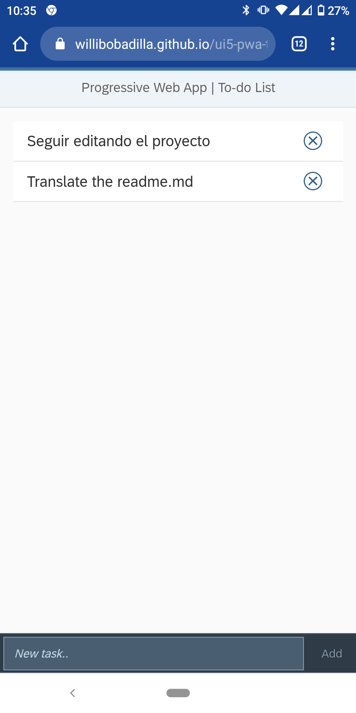
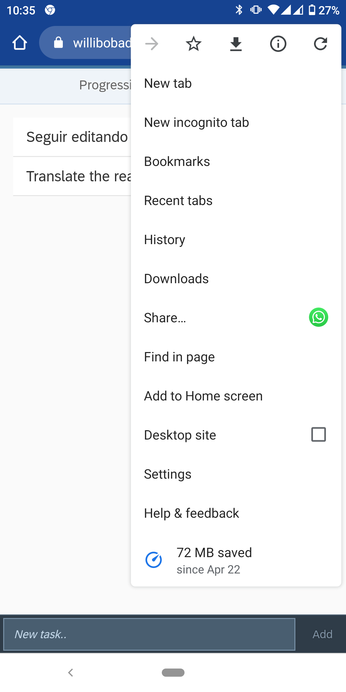
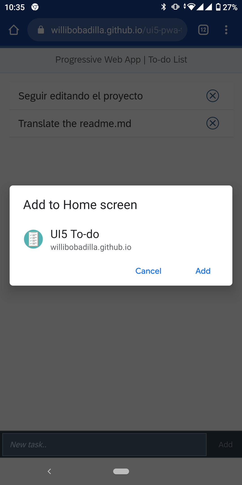
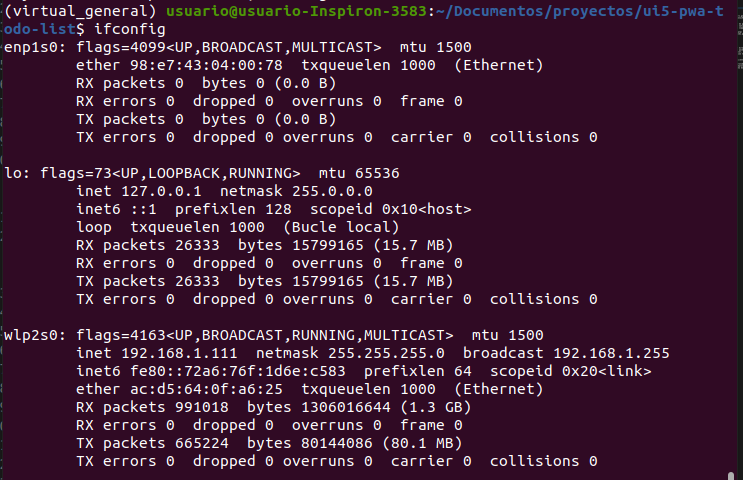
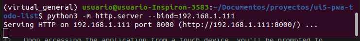
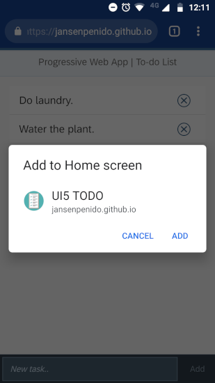
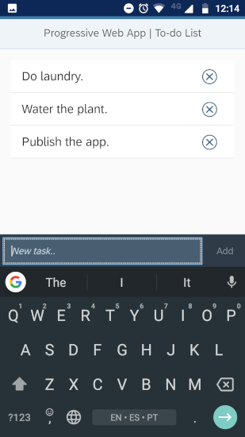

# UI5 PWA To-do List ( Lista de tareas)

### [Demo online](https://willibobadilla.github.io/ui5-pwa-todo-list/webapp/)
#### Forkeado de: https://github.com/jansenpenido/ui5-pwa-todo-list

## Descripcion General
Una simple lista de tareas [Progressive Web App](https://developers.google.com/web/progressive-web-apps/) gracias a [OpenUI5](https://openui5.org/) y Node.js.

Al acceder a la aplicacion desde un dispositivo touch, saltará una notificacion para anhadir a tu página de inicio, asi que esto funcionaría como una aplicacion nativa, incluyendo la pantalla completa y el soporte fuera de línea.

## Screenshoots (Una vez ingresado en el Demo online)

Entrar en las opciones (los tres puntitos)

Darle "Agregar al inicio" (Add to home screen)

Darle "Agregar" (Add) 

## Instrucciones
### Correr localmente (Python http server)
Suponiendo que tenes python instalado en tu máquina con linux.
1. Clonar este repositorio.
2. Abrir la terminal e ir hasta la carpeta "webapp".
3. Correr el siguiente comando en la terminal `ifconfig`. 
4. Anotar el número ip en tu red, que es el inet. (ver imagen 1 abajo)
5. Correr el siguiente comando ` python3 -m http.server --bind=192.168.1.111`, reemplazar la ip con la tuya. (ver imagen 2 abajo)
6. Ver en que puerto corre el server, normalmente en el 8000. (ver imagen 2 tambiién abajo)
7. Desde cualquier dispositivo con el navegador entrar a la direccion tu_ip:tu_puerto, para mi caso seria 192.168.1.111:8000 

### Imagenes de los pasos para correr localmente 

Imagen 1 ( Comando ifconfig para saber tu ip local )

Imagen 2 ( Correr el server local y ver el puerto )

## Overview
A simple To-do List [Progressive Web App](https://developers.google.com/web/progressive-web-apps/) powered by [OpenUI5](https://openui5.org/) and Node.js.

Upon accessing the application from a touch device, you'll be prompted to add it to your home screen, so that it'll work just like a native mobile application, including full-screen interaction and offline support.

## Instructions

### Run locally (Node.js server)
1. Clone/download this repository.
1. Open the terminal and navigate to the repository's root directory.
1. Run the command `npm install` to download the necessary packages.
1. Run the command `node server.js` to start the app's server.
1. Open the browser and enter `http://localhost:8809/` to see the app.

## Acknowledgments
- The app 'clipboard' icon was designed by [Juliia Osadcha](https://juliiaosadcha.com/).
- This project was inspired by OpenUI5's official sample provided [here](https://github.com/SAP/openui5-pwa-sample). In order to improve the user experience, the project has been refactored according to the UI5's MVC standards and Fiori Guidelines.
